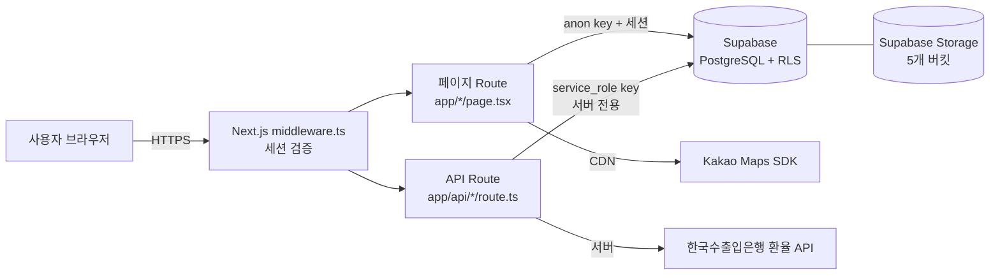

# 시스템 개발 명세서 (system-spec.md)

> 본 문서는 실제 코드베이스(`customer-map-web`)와 설정 파일에서 확인된 사실만 기재한다.
> 코드/설정에서 확인 불가능한 항목은 **"확인 필요"** 로 명시한다.
> 민감 정보(키·비밀번호·토큰 실제 값)는 기재하지 않으며 "환경변수로 관리됨" 으로만 표기한다.
> 작성 기준일: 2026-06-29

---

## 1. 프로젝트 개요

| 항목 | 내용 |
|---|---|
| 시스템명 | customer-map-web (사내 고객사 관리 웹) |
| 목적 | 고객사·장비·서비스 활동을 지도 기반으로 관리하고, 견적·실적·재고·발주를 통합 운영 |
| 주요 데이터 | 고객사 정보(상호·주소·좌표·상태), 담당자 연락처, 장비 정보 및 납입의사록·패킹리스트, 서비스 레포트, 견적서(재무), 엔지니어/직원 정보, 실적·재고·발주 데이터 |
| 사용자 | 사내 직원(엔지니어·관리자). 로그인 계정 기반. **총 사용자 규모는 확인 필요** (engineers 테이블 실제 행 수 미확인) |
| 접근 제어 | 로그인 필수. 역할(permission_level): `superadmin`, `manager`, `member` + 재고관리자 플래그(`is_inventory_manager`) |

---

## 2. 기술 스택

### 2.1 런타임·프레임워크 (package.json 기준 실제 버전)

**dependencies**

| 패키지 | 버전 |
|---|---|
| next | 16.2.7 |
| react | 19.2.3 |
| react-dom | 19.2.3 |
| @supabase/supabase-js | ^2.100.0 |
| @supabase/ssr | ^0.9.0 |
| @react-pdf/renderer | ^4.5.1 |
| jspdf | ^4.2.1 |
| jspdf-autotable | ^5.0.7 |

**devDependencies**

| 패키지 | 버전 |
|---|---|
| typescript | ^5 |
| eslint | ^9 |
| eslint-config-next | 16.1.7 |
| tailwindcss | ^4 |
| @tailwindcss/postcss | ^4 |
| @types/node | ^20 |
| @types/react | ^19 |
| @types/react-dom | ^19 |
| xlsx | ^0.18.5 (개발 스크립트 전용 — 보안 점검 후 devDependencies로 재분류) |

- **언어**: TypeScript (^5), React 19 + Next.js App Router
- **Node.js 버전**: `package.json`에 `engines` 미지정, `.nvmrc`/`.node-version` 없음 → **확인 필요**(Vercel 기본 런타임)
- **루트 유틸 스크립트**: `geocode_update.js`, `upload_price_list.js`, `scripts/gen-service-report-template.js` (개발/운영 보조 도구, 앱 번들 미포함). `gen-service-report-template.js`는 `exceljs`를 사용하나 package.json에 미등록 → **확인 필요**

### 2.2 인프라 구성

| 구성 | 서비스 | 역할 |
|---|---|---|
| 호스팅 | Vercel | Next.js 앱 배포, 서버(Route Handler)·엣지, 환경변수 관리 |
| DB/Auth/Storage | Supabase | PostgreSQL(RLS), 인증(세션 쿠키), 파일 스토리지 |
| 지도 | Kakao Maps JavaScript SDK (`dapi.kakao.com`, CDN 로드) | 지도·마커·지오코딩 |
| 외부 API | 한국수출입은행 환율 API (`oapi.koreaexim.go.kr`) | 견적용 JPY 환율 조회 |

> Supabase 프로젝트 리전/데이터 소재지는 코드에서 확인 불가 → **확인 필요**(대시보드)

---

## 3. 시스템 아키텍처

### 3.1 전체 구조

- **클라이언트→DB 직접 접근**: 페이지는 브라우저에서 `@supabase/ssr` 클라이언트(anon key + 사용자 세션)로 Supabase에 직접 질의 → 접근 통제는 **RLS에 의존**
- **서버 경유(service_role)**: 권한 상승이 필요한 작업만 `app/api/*/route.ts`에서 service_role 키로 처리(사용자 생성/삭제, 이미지·PDF signed URL 발급 등)

### 3.2 인증 흐름

1. 로그인: `app/login/page.tsx` → Supabase Auth (`supabase.auth.signInWithPassword`)
2. 세션 쿠키 발급 → 이후 요청에 자동 포함
3. `middleware.ts`가 모든 페이지 요청에서 `supabase.auth.getUser()`로 세션 검증
   - 미로그인 + `/login` 외 경로 → `/login`으로 리다이렉트
   - 로그인 + `/login` 접근 → `/`로 리다이렉트
   - `matcher`: `/((?!_next/static|_next/image|favicon.ico).*)`
4. `/api/*` 경로는 middleware를 통과시키며(주석 명시), **각 API 라우트가 자체적으로 `getUser()` 검증** 수행

---

## 4. 데이터베이스 구조

### 4.1 전체 테이블 목록 (코드 내 `.from('...')` 기준, 21개)

`audit_log`, `bulk_uploads`, `contacts`, `customers`, `devices`, `download_logs`, `engineers`, `exchange_rate`, `inventory_items`, `inventory_logs`, `inventory_requests`, `notifications`, `price_list`, `purchase_orders`, `quote_items`, `quote_sequence`, `quotes`, `sales_targets`, `service_engineers`, `service_history`, `teams`

> 각 테이블의 전체 컬럼·제약은 DB 스키마 원본에서 확인 필요. 아래는 코드(타입 정의·insert/select·FK 오류)에서 **확인된 범위**만 기재.

### 4.2 핵심 테이블 (확인된 컬럼·관계)

| 테이블 | PK | 확인된 주요 컬럼 | FK/관계(확인) |
|---|---|---|---|
| customers | customer_id | company_name, address, status, agency, latitude, longitude | — |
| contacts | contact_id | customer_id, name, department, position, phone, email | customer_id → customers |
| devices | device_id | customer_id, device_name, device_name2, option, serial_number, packing_list_url, install_date, install_year, program, image_url, category | customer_id → customers |
| service_history | service_id | customer_id, device_id, contact_id, visit_year, visit_date, service_notes, etc_notes, visitor, service_type, is_paid, work_hours, report_url | contact_id → contacts (`service_history_contact_id_fkey`), customer_id → customers, device_id → devices |
| service_engineers | (service_id, engineer_id) | service_id, engineer_id | 서비스↔엔지니어 N:M 연결 |
| engineers | engineer_id | name, position, teams, email, initials, permission_level, is_inventory_manager, profile_image_url, resigned_date | — |
| teams | id | name, is_special, display_order | — |
| quotes | quote_id | quote_number, quote_date, customer_id, dealer_id, engineer_id, total_supply, status, pdf_url, 발주/세금 관련 컬럼 다수 | customer_id → customers (`quotes_customer_id_fkey`), dealer_id → customers (`quotes_dealer_id_fkey`) |
| quote_items | id | quote_id, product_name, price 관련 | quote_id → quotes |
| download_logs | 확인 필요 | engineer_id, quote_id, quote_number, company_name, action('view' 등) | 견적 PDF 열람/다운로드 기록용 |
| audit_log | id | occurred_at, actor_uid, actor_email, action, table_name, row_id, old_data, new_data | 보안 점검 시 신설(감사 로그) |

> 그 외 테이블(bulk_uploads, exchange_rate, inventory_items, inventory_logs, inventory_requests, notifications, price_list, purchase_orders, quote_sequence, sales_targets)의 컬럼·관계는 **확인 필요**.

### 4.3 RLS(Row Level Security) 활성화·정책 현황

| 테이블/버킷 | RLS 상태(확인된 사실) | 비고 |
|---|---|---|
| teams | RLS **활성**(정책 위반 오류로 확인). INSERT 정책 누락 → 점검 중 정책 SQL 제공(`teams_rls_policy.sql`) | 적용 여부는 대시보드 확인 필요 |
| customers, devices, contacts, service_history 등 | 앱에서 직접 insert/update 동작 → **허용 정책 존재 추정**(정확한 정책 내용 확인 필요) | RLS 활성 여부·정책 원문 확인 필요 |
| audit_log | RLS 활성 + superadmin 전용 SELECT 정책 (신설 SQL `audit_log_setup.sql`) | 실행 후 적용 |
| 그 외 전 테이블 | **확인 필요** — "모든 테이블 RLS 활성 + UNRESTRICTED 0개" 여부는 Supabase 대시보드에서 전수 확인 필요 | 감사 필수 확인 항목 |

---

## 5. 페이지/기능 목록

### 5.1 페이지 라우트 (app/*/page.tsx, 13개)

| 경로 | 기능 | 접근 권한(확인된 범위) |
|---|---|---|
| `/login` | 로그인 | 비로그인 허용(유일) |
| `/` | 고객사 현황(지도·목록·업체 등록) | 로그인 필수(middleware) |
| `/customer/[id]` | 업체 상세(담당자·장비·서비스 레포트·견적 이력) | 로그인 필수 |
| `/activity` | 활동 현황(엔지니어별 서비스 집계) | 로그인 필수 |
| `/quote` | 견적서 작성 | 로그인 필수 |
| `/sales` | 실적 현황 | 로그인 필수. 열람 범위 코드상 role별 필터(superadmin 전체 / manager 자기팀 / member 본인) |
| `/purchase` | 발주 관리 | 로그인 필수 |
| `/inventory` | 재고 관리 | 로그인 필수 |
| `/library` | 자료실 | 로그인 필수 (현재 "추후 업데이트 예정" 안내 화면) |
| `/admin` | 관리자(직원·팀·목표·견적삭제·다운로드로그) | 로그인 필수 + 화면 내 기능은 `superadmin` 전용 버튼 게이팅 |
| `/account` | 내 계정(비밀번호 변경 등) | 로그인 필수 |
| `/add` | (업체/데이터 추가 관련) | 로그인 필수 — 세부 기능 확인 필요 |
| `/service-add` | (서비스 추가 관련) | 로그인 필수 — 세부 기능 확인 필요 |

### 5.2 API 라우트 (app/api/*/route.ts, 11개) 및 권한 체크

| 엔드포인트 | 인증(getUser) | 권한 체크(확인된 조건) |
|---|---|---|
| `/api/create-user` | O | `permission_level ∈ {superadmin, manager}` |
| `/api/delete-user` | O | 동일 + 대상이 superadmin/manager면 superadmin만 |
| `/api/update-engineer` | O | 동일. permission_level 변경은 superadmin만 |
| `/api/delete-quote-pdf` | O | `{superadmin, manager}` |
| `/api/auto-fail` | O | `{superadmin, manager}` |
| `/api/inventory-approval` | O | `is_inventory_manager 또는 superadmin` |
| `/api/purchase-order` | O | `superadmin 또는 teams='영업관리'` |
| `/api/device-image` | O | 로그인 + DB로 소유 이미지 확인 + 경로검증 |
| `/api/profile-image` | O | 로그인 + DB 확인 + 경로검증 |
| `/api/quote-pdf` | O (보안점검 시 추가) | 로그인 + 실제 견적 확인 + 경로검증 |
| `/api/exchange-rate` | O (보안점검 시 추가) | 로그인만(공개 환율 데이터) |

---

## 6. 보안 구현 상세

### 6.1 인증/인가
- **세션 검증 위치**: `middleware.ts`(전 페이지) + 각 `app/api/*/route.ts`(서버 `supabase.auth.getUser()`)
- 클라이언트 페이지는 anon key로 Supabase 직접 접근 → **RLS가 실질 접근 통제선**

### 6.2 RBAC(역할 기반 접근제어)
- 역할 값: `superadmin`, `manager`, `member` (engineers.permission_level) + `is_inventory_manager`(boolean) + 특수 팀 `임원`, `영업관리`
- **서버 강제 지점**: 위 5.2 표의 API 라우트에서 `permission_level` 조회 후 403 처리
- **클라이언트 게이팅**: `/admin` 등에서 버튼 노출을 superadmin으로 제한(UI). UI 게이팅은 보조 수단이며 실제 강제는 서버/RLS

### 6.3 Storage 버킷 (코드 내 `.storage.from` 기준 5개)

| 버킷 | 접근 방식(확인) | 공개/비공개(확인) |
|---|---|---|
| device-images | 기본 이미지는 public URL(`/object/public/device-images/...`) 사용, 업로드본은 `/api/device-image` signed URL 경로도 존재 | **공개 추정** — 실제 설정 확인 필요 |
| profile-images | `/api/profile-image` signed URL(1시간) | 비공개(코드 전제) |
| quote-pdfs | `/api/quote-pdf` signed URL(1시간) | 비공개(코드 전제) |
| packing-lists | 클라이언트 `createSignedUrl`(1시간), DB에 경로만 저장 | 비공개(정책 SQL 제공) |
| service-report | 클라이언트 `createSignedUrl`(1시간), DB에 경로만 저장 | 비공개(정책 SQL 제공) |

> 버킷 Public/Private 실제 설정은 Supabase 대시보드에서 확인 필요.

### 6.4 전송·저장 암호화
- **전송**: Vercel/Supabase HTTPS. 앱 응답에 HSTS(`max-age=63072000; includeSubDomains; preload`) 설정
- **예외**: `/api/exchange-rate`는 한국수출입은행 서버 통신 시 `rejectUnauthorized:false`(TLS 검증 우회) — 대상 호스트 고정, 수신 데이터는 공개 환율. 완전 제거는 정부 CA 주입 필요(확인/조치 필요)
- **저장 암호화**: Supabase(Postgres/Storage) 저장 시 암호화 여부는 **확인 필요**(Supabase 플랫폼 설정)

### 6.5 응답 보안 헤더 (`next.config.ts`, 전 경로 적용)

| 헤더 | 값(요약) |
|---|---|
| Content-Security-Policy | default-src 'self'; connect/script/style/img/frame/worker-src 화이트리스트 지정(Supabase, Kakao, Google Fonts 등). `frame-ancestors 'none'`, `base-uri 'self'`, `form-action 'self'` |
| Strict-Transport-Security | max-age=63072000; includeSubDomains; preload |
| X-Frame-Options | DENY |
| X-Content-Type-Options | nosniff |
| Referrer-Policy | strict-origin-when-cross-origin |
| Permissions-Policy | camera=(), microphone=(), geolocation=() |
| X-XSS-Protection | 1; mode=block |

- CSP `script-src`에 `'unsafe-inline' 'unsafe-eval'` 및 로컬 개발용 `http://` 카카오 도메인 포함(운영 강화 여지)
- CORS 커스텀 헤더 없음 → 기본 same-origin

---

## 7. 배포/운영 환경

| 항목 | 내용 |
|---|---|
| 배포 | Vercel (Git 연동 배포 추정 — 파이프라인 세부 확인 필요) |
| 환경변수 | **모두 환경변수로 관리됨** — `NEXT_PUBLIC_SUPABASE_URL`, `NEXT_PUBLIC_SUPABASE_ANON_KEY`, `NEXT_PUBLIC_KAKAO_JS_KEY`(공개용), `SUPABASE_SERVICE_ROLE_KEY`(서버 전용), `KOREA_EXIM_API_KEY`(서버 전용). `.env.local`은 `.gitignore`(`.env*`)로 제외, git 미추적·커밋 이력 없음 |
| service_role 키 | `app/api/*/route.ts`에서만 참조 — 클라이언트 번들 미포함 |
| Vercel 환경변수 범위(Production/Preview 분리) | **확인 필요**(대시보드) |
| 백업 | Supabase 백업/PITR 설정 여부 **확인 필요**(대시보드) |
| 감사 로그 | 견적 PDF 열람/다운로드: `download_logs` 테이블 존재·기록 중. 데이터 변경 전반: `audit_log`(보안 점검 시 신설, SQL 실행 필요) |

---

*본 명세서는 정적 코드 분석 기준이며, "확인 필요" 항목은 Supabase/Vercel 대시보드 및 DB 스키마 원본으로 별도 검증이 요구된다.*
